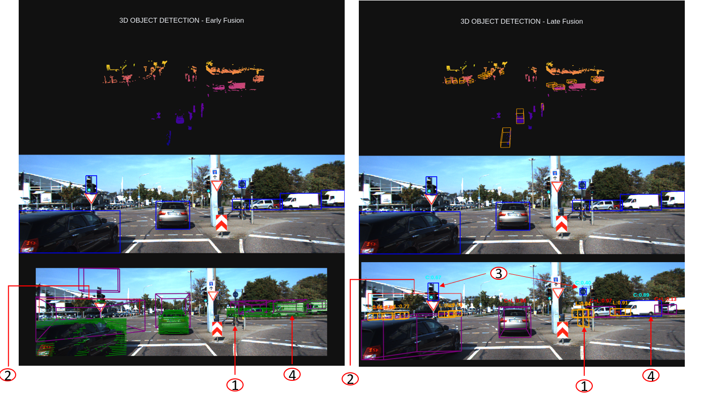

## Overview
This repository compares two Lidar-camera fusion strategies - early fusion and late fusion - for 3D object detection - through a code implementation using the [KITTI dataset](https://www.cvlibs.net/datasets/kitti/eval_object.php?obj_benchmark=3d), the [PV-RCNN++](https://arxiv.org/pdf/2102.00463) (lidar 3d object detection model) and [Yolov8](https://docs.ultralytics.com/models/yolov8/) (camera 2d object detection model) to evaluate each approach.

## Inference Results: Early vs Late Fusion

  <strong style="display: inline-block; margin: 0 20px;">Early Fusion – 3D Object Detection Results</strong> 

 
   

  <strong style="display: inline-block; margin: 0 20px;">Late Fusion – 3D Object Detection Results</strong>

 
   

## Understanding Fusion Approaches
**Early Fusion**
- Early fusion combines raw or low-level features from different sensors at the beginning of the detection pipeline. In our implementation, we:
- Start with 2D object detection (Yolov8) from camera images
- Project LiDAR points into the image plane
- Associate LiDAR points with 2D detections
- Use these points to estimate 3D properties like position, dimensions, and orientation

**Late Fusion**
- Late fusion keeps sensor processing streams separate and combines their high-level outputs. Our implementation:
- Processes camera images to get 2D detections (Yolov8)
- Uses PV-RCNN++ to get 3D detections from LiDAR
- Combines detections using IoU matching and confidence scores

# Visual Comparison of Results

  <strong style="display: inline-block; margin: 0 20px;">Early vs Late Fusion – 3D Object Detection Results</strong> 

 
   

1- By processing LiDAR independently, late fusion can detect objects beyond the camera's range. For example, a small bike might be picked up by LiDAR but missed by the camera, so early fusion overlooks it.

2- If the camera fails to detect distant vehicles, early fusion doesn't create 3D boxes for them even though LiDAR points are available. In contrast, late fusion successfully detecting and boxing these distant vehicles (shown with orange boxes).

3- In both early and late fusion, we still rely on 2D detections for small or distant objects - like traffic lights - since LiDAR data for them is often sparse.

4- LiDAR points exist for trucks, but since the KITTI 3D object detection dataset doesn't label them, late fusion misses these trucks while early fusion detects them.

**3D Box Precision**:

Purple 3D boxes in early fusion can be less accurate than those in late fusion because they rely on estimated LiDAR depth and calibration, which is challenging to get precisely right.

For detailed analysis, check our [Medium article](https://medium.com/@az.tayyebi/early-vs-late-camera-lidar-fusion-in-3d-object-detection-a-performance-study-5fb1688426f9)

## Requirements

Python 3.8+

PyTorch

CUDA support

[KITTI dataset](https://www.cvlibs.net/datasets/kitti/eval_object.php?obj_benchmark=3d)

[Yolov8 pretrained weights](https://github.com/ultralytics/ultralytics/blob/main/docs/en/models/yolov8.md) I didn’t notice any accuracy difference between YOLOv8 and YOLOv11. I used v8, but feel free to use v11 if it’s easier to find documentation or pretrained weights for it.

[PV-RCNN++](https://github.com/open-mmlab/OpenPCDet/tree/master?tab=readme-ov-file)

## Installation

git clone [Lidar-CameraFusion-3DobjectDetection](https://github.com/Azitt/Lidar-CameraFusion-3DobjectDetection)

cd Lidar-CameraFusion-3DobjectDetection

pip install -r requirements.txt

## Demo
python main.py

## Acknowledgments

This repository includes Lidar 3D object detection code adapted from [OpenPCDet](https://github.com/open-mmlab/OpenPCDet), an open-source project for LiDAR-based 3D perception.

We appreciate the efforts of the OpenPCDet contributors for providing a robust foundation for LiDAR-based 3D object detection.

